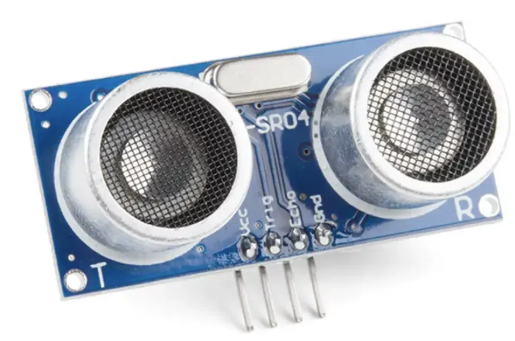

# Ultrasonic Sensors
They measure distance by using sonar - the same method bats and submarines use to navigate. By emitting a high-frequency sound wave and timing how long it takes to bounce back, it can calculate exactly how far away an object is. 

<p align="center">
    
</p>

## Basic informations
- **Supply voltage**: 5V DC
- **Average current consumption**: 15mA
- **Measuring range**: 2cm to 200 cm

## How does it work? 
The sensor consists of two main parts; an ultrasonic transmitter (which acts like a speaker) and a receiver (which acts like a microphone). 

1. **Trigger**: The MCU sends a short, 10-microsecond electrical pulse to the sensor's trig pin.

2. **Emit**: The sensor responds by transmitting an 8-pulse burst of ultrasonic sound at 40 kHz.

3. **Echo**: The sound waves travel through the air until they hit an object and bounce back.

4. **Receive**L The receiver detects the returning wave and sets the echo pin HIGH for the exact duration the sound wave spent traveling.

## Distance estimation
To find distance, you measure the time the echo pin stayed HIGH and use the speed of sound ***343 m/s*** or ***0.0343 cm/μs***. Because the sound had to travel to the object and back, you divide the total result by 2:

```math
Distance = \frac{Time \cdot 0.0343 }{2}
```

## Applied filter
In this project, we decided to use median of three filter to smooth out distance readings and eliminate erratic spikes before transmitting data. The filtered output is safely capped at maximum value of 100 cm. 